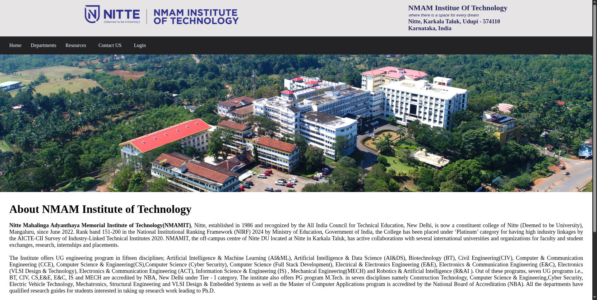
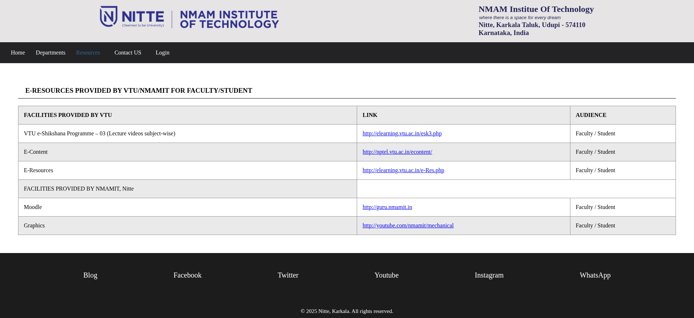
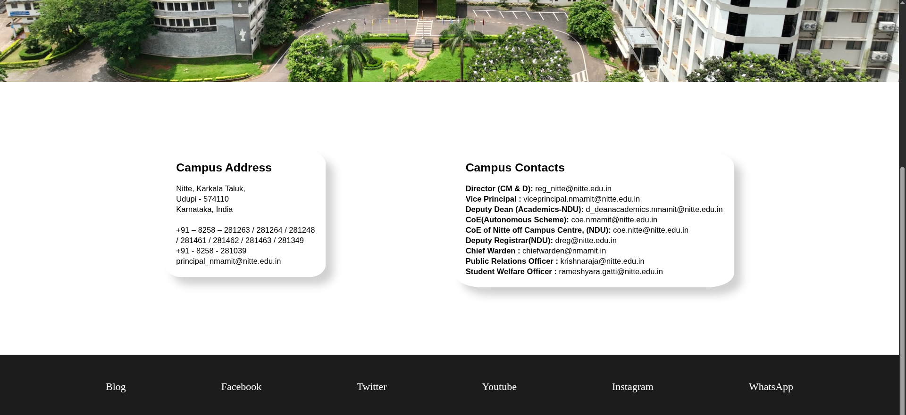

# NMAMIT Frontend

A responsive frontend website developed for NMAM Institute of Technology that provides department information, academic resources, contact details, and a simple login interface. The project is built using HTML and CSS and serves as an informational portal for students and visitors.

## Live Demo

🌐 **Website:** https://atmikanayak.github.io/nmamit-frontend/

---

## Features

* Responsive homepage
* Department pages for CSE, ISE, and ECE
* Academic resources section
* Contact information page
* Login form
* Department navigation menu
* Clean and organized UI

---

## Tech Stack

### Frontend

* HTML5
* CSS3

---

## Screenshots

### Home Page



### Computer Science Department


### Resources Page



### Contact Page



---

## Project Structure

```text
nmamit-frontend/
├── css
│   ├── contact.css
│   ├── cse.css
│   ├── login.css
│   ├── resources.css
│   └── style.css
├── html
│   ├── contact.html
│   ├── cse.html
│   ├── ece.html
│   ├── ise.html
│   ├── login.html
│   └── resources.html
├── images
│   ├── CSE.jpg
│   ├── contact.jpg
│   ├── contact.png
│   ├── department.png
│   ├── ece.jpg
│   ├── hoome.png
│   ├── ise.webp
│   ├── logo.png
│   ├── nmamit.jpg
│   └── resource.png
└── index.html
```

---

## Pages

### Home Page

* Introduction to NMAMIT
* Department navigation
* Quick access to resources and contact information

### Department Pages

* Computer Science & Engineering (CSE)
* Information Science & Engineering (ISE)
* Electronics & Communication Engineering (ECE)
* Department overview and placement information

### Resources Page

* VTU e-learning resources
* NMAMIT academic resources
* Useful educational links for students

### Contact Page

* Campus address
* Institutional contact information
* Administrative contact details

### Login Page

* Basic login form
* Student information fields

---

## Installation

```bash
git clone https://github.com/AtmikaNayak/nmamit-frontend.git

cd nmamit-frontend
```

Open:

```bash
index.html
```

Or run using VS Code Live Server.

---

## Author

### Atmika Nayak
