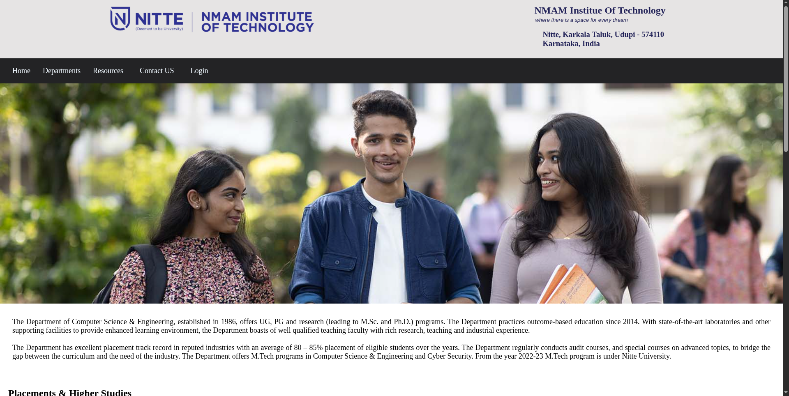

# NMAMIT Frontend

A static college website developed for NMAM Institute of Technology. The website provides department information, academic resources, contact details, and student-oriented navigation through a clean and responsive interface.

## Features

- Homepage with institute information
- Department pages (CSE, ISE, ECE)
- Resources section
- Contact page
- Login page
- Responsive layout

## Tech Stack

<p>
  
  
</p>

## Project Structure

```text
nmamit-frontend/
├── css
├── html
├── images
└── index.html
```

## Running Locally

1. Clone the repository

```bash
git clone <repository-url>
```

2. Open the project directory

```bash
cd nmamit-frontend
```

3. Launch `index.html` in a browser or use VS Code Live Server.

## Running Tests

No automated tests are configured for this project.

## Integration Notes

This project can serve as a frontend template for educational institutions and can be extended with backend services for authentication, admissions, and resource management.

## Visuals

### Home Page


### Department Page



### Contact Page


## Live Demo

https://atmikanayak.github.io/nmamit-frontend/

## Additional Resources

- NMAMIT Official Website: https://www.nmamit.in/
